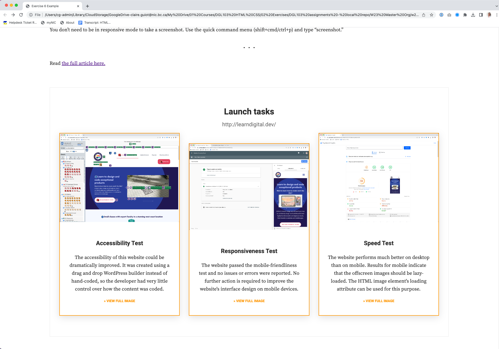

# Exercise 6

## Objectives
This exercise is divided into 3 tasks: 
1. First you will troubleshoot and correct the errors in the provided HTML file;
2. Then you will write CSS to style the page so that it looks like the provided webpage. 
3. Finally you will chose a random website and complete some launch tasks. You will add your results to the bottom of HTML file, and use CSS to style the content into cards.


## Instructions
Remember to:
* Regularly save your files and check out what your web page looks like in a web browser.
* :warning: Make regular commits and pushes. **Make sure that you have read the Git Commits Best Practices document that was provided in this week's reading. Your instructor will be looking at how you wrote your commit messages!**
### Get set up
* Clone your remote exercise repository onto your local machine.
* Add a comment in the head element of the homepage including: the course code and your section number - your name - Exercise 6. Example:
```
<!-- DGL 103 CVS1 - your name - Exercise 6 -->
```
### Task 1: Debug your code
Open index.html in VS Code and debug the errors.
1. Highlight any errors: Use the HTMLHint extension in VS Code to highlight issues and help you troubleshoot your code. Note: If the debugger is not working then you may be in restricted mode and need to turn on Workspace Trust. Click on the Manage Gear button at the bottom of the screen on the left-hand side, then select Manage Workspace Trust to switch between Trusted and Restricted modes.
2. Improve your formatting: Use the Prettier extension to help you format your code, it is a fast way to make your code easier to read and highlight nesting hierarchy issues.
3. Use the Chrome Developer Tools: Open index.html in Chrome, right-click > Inspect.
Click on the Elements tab, one by one, click on the arrows to open up the parent elements and drill down the descendant elements. This helps you see how the browser has interpreted the nesting of your elements.
4. Use the HTML and CSS validator service by W3C to check for any outstanding errors.

### Task 2: Style the content
1. In VS Code, create an external stylesheet and link it to your index.html file.
2. Open https://askclaireguiot.github.io/w23-exercise-6-example/ in Chrome, right-click > Inspect. In the Inspector's Styles tab, you can see the styles that are applied to the individual HTML elements. If a style is italicized and the source is stated as "user agent stylesheet", that means the style you are viewing is the HTML element's default styling. 
Using the information in the Styles tab, reverse-engineer the styles for this page. Copy and paste the styles from the Styles tab directly into your stylesheet. Keep going until you are sure that you have styled your whole index.html to look exactly like the live webpage.
2. Organize your CSS so that it is easy to read. You could also validate it to make sure that you haven't made any errors.

### Task 3: Practice some launch tasks
1. Choose any live website you like, and try out the three launch tasks below:
    * Go to https://wave.webaim.org and enter your chosen website's URL in the web address field to check the accessibility of the website. Check out all the accessibility errors and alerts in the Details tab. Take a screenshot and save it in your images folder. Make sure you name the file appropriately. 
    * Now let's check to see if the website is mobile-friendly (if it isn't then search engines will penalise it and visitors will have a poor experience. Go to https://search.google.com/test/mobile-friendly and enter your chosen website in the URL field. Take a screenshot of the results and save it in the images folder.
    * Now let's see how quickly the homepage of the website loads. Go to https://developers.google.com/speed/pagespeed/insights/ and enter the URL. Take a screenshot of the Mobile results and save it. Click on the Desktop results, are they better than the mobile results?
  
2. Add your testing results to the bottom of your index.html file. For each test, create a card that includes the screenshot and a sentence about how well your chosen website performed in the different tests and suggest changes what you could do to the website to improves its results. When you click on a card, the full-size image must open in a new browser window. Style your content any way you like but put some effort into it (it doesn't have to look like the crads in the example below). Don't forget to include the URL of the website that you tested in the content.


### Format, organize and add comments 
* Use the Prettier VSCode extension to format HTMl and CSS code.
* Add organizational CSS comments and order your style rules so that your CSS is easy to read.
* Add a few comments to explain your HTML and CSS code and highlight anything of interest.

### Check for errors
Use the VSCode HTMLHint extension and validate your code to make sure that it is correct (https://validator.w3.org/#validate_by_upload for HTML, https://jigsaw.w3.org/css-validator/ for CSS).

### Submit your work
1. Commit your changes.
2. Push your changes to GitHub.
3. Submit in Brightspace to the "Unit 2 Exercises" assignment and follow the instructions. This is your last exercise of the unit:
    * Grade all three of your exercises and answer the reflection questions.
4. If you have been using a lab computer on campus, remember to restart the computer.

## Deadlines
Assignments must be submitted before the end of the week but they will only be graded at the end of every unit. Late assignments will not be accepted and will receive an F. You can complete and submit a contract that allows you to extend the deadline for an assignment but you must email it to your instructor a minimum of 48 hrs before the deadline. Deadline extensions are only allowed for those unplanned, unexpected emergencies that life sometimes throws at us, and they will only be approved by your instructor if you follow the correct process. See the Course Info folder in BrightSpace for more info.